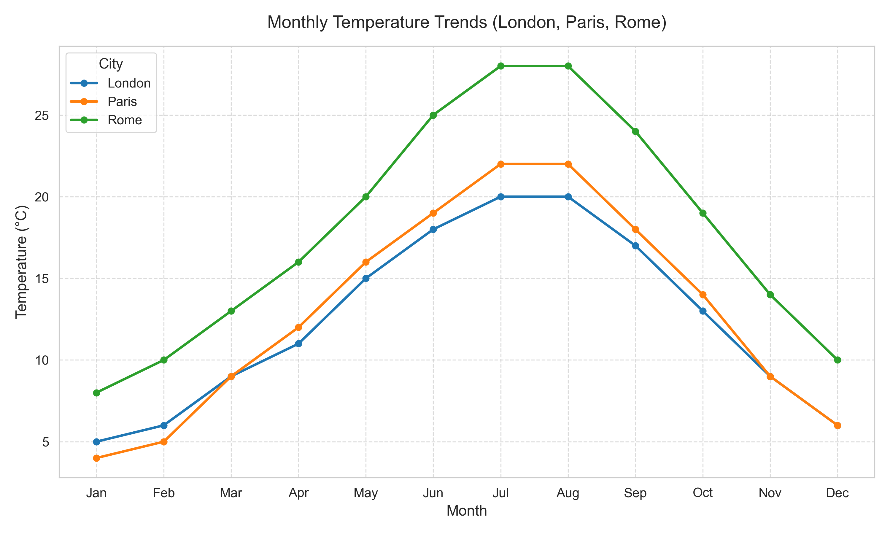
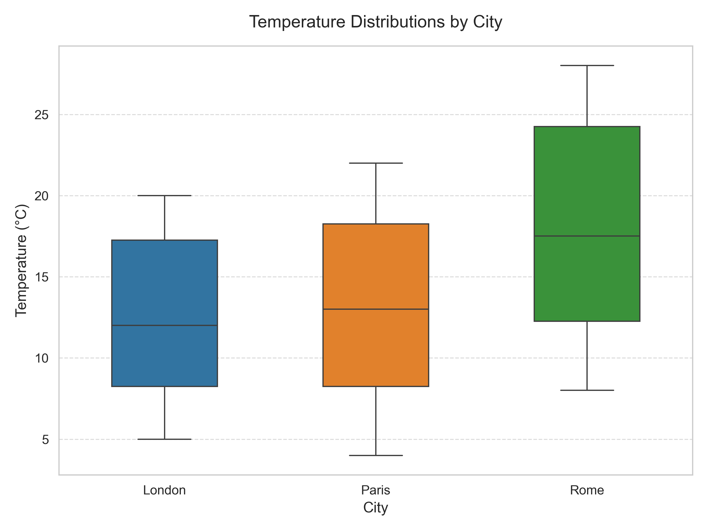
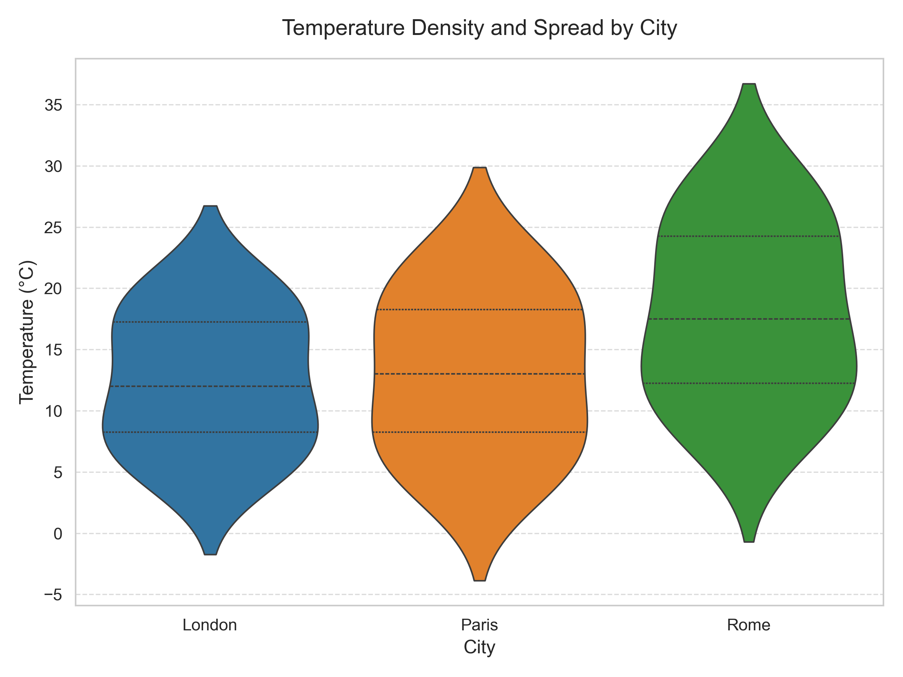
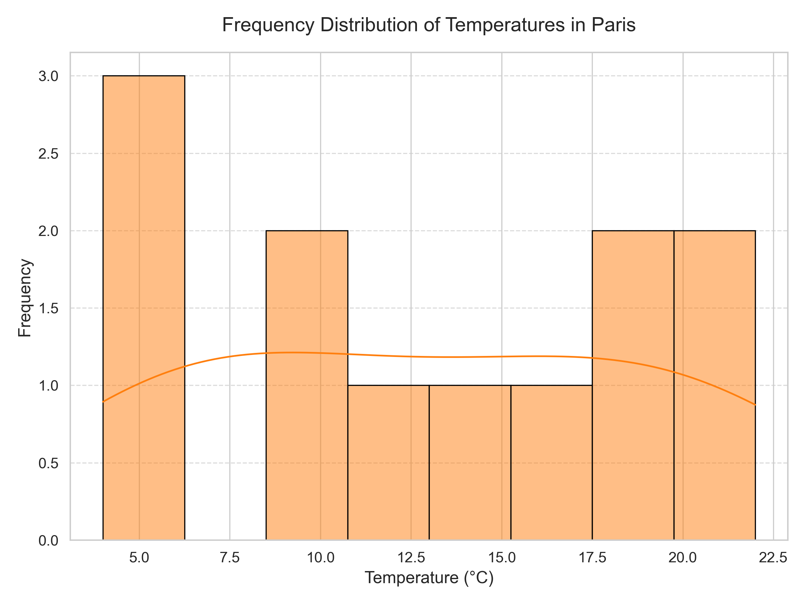

# Analyzing City Temperature Variations
## Integrated Final Report

---

# Part 1: Improved Visualization Plan

This section outlines the visualization set designed to meet academic standards and provide clear insights into the dataset.

### 1. Line Chart: Monthly Temperature Trends
*   **Description:** A multi-line chart plotting temperature (°C) against months for London, Paris, and Rome on a single set of axes.
*   **Justification:** This visualization answers the question **"How do temperature trends compare seasonally?"**. It allows for direct comparison of warming and cooling rates and peak temperatures across the year. The academic style uses distinct markers and a clean grid for precision.
*   **Visual Reference:** See Figure 1 below.

### 2. Box Plot: Comparing Distributions
*   **Description:** Side-by-side box plots for each city, displaying the median, quartiles, and range.
*   **Justification:** This visualization answers the question **"Which city has the most consistent temperature?"**. It provides a compact summary of central tendency and spread, highlighting differences in variability (interquartile range) and identifying any potential outliers.
*   **Visual Reference:** See Figure 2 below.

### 3. Histogram: Frequency Distribution (Paris)
*   **Description:** A histogram with a Kernel Density Estimate (KDE) overlay, focusing on Paris.
*   **Justification:** This visualization answers the question **"What is the shape of the data distribution?"**. Paris was selected because its descriptive statistics suggestion a near-normal distribution. This plot visually confirms that symmetry, showing a single central peak.
*   **Visual Reference:** See Figure 3 below.

### 4. Violin Plot: Density and Spread
*   **Description:** Violin plots for all three cities, combining box plot elements with a kernel density plot.
*   **Justification:** This visualization answers the question **"How is the data density distributed?"**. It offers a deeper view than the box plot by revealing the full shape of the distribution, clearly showing the symmetry of Paris versus the skewness of Rome and London.
*   **Visual Reference:** See Figure 4 below.

---

# Part 2: Final Written Report

## 1. Introduction
This analysis examines the monthly average temperatures for three major European cities: London, Paris, and Rome, over a one-year period. The objective is to utilize transparency in descriptive statistics and graphical visualizations to compare climatic patterns, assess variability, and analyze the distribution characteristics of each city's temperature profile.

## 2. Descriptive Statistics
Key statistical measures were calculated to summarize the central tendency and dispersion of the data.

| Statistic | London | Paris | Rome |
| :--- | :--- | :--- | :--- |
| **Mean** | 12.25 °C | 13.08 °C | 17.08 °C |
| **Median** | 12.0 °C | 13.0 °C | 17.5 °C |
| **Mode** | [20, 9, 6] | [22, 9, 6] | [28, 14, 10] |
| **Range** | 15 °C | 18 °C | 20 °C |
| **Variance** | 25.688 | 35.743 | 40.576 |
| **Standard Deviation** | 5.068 °C | 5.979 °C | 6.37 °C |
| **IQR** | 9.75 °C | 10.75 °C | 9.5 °C |

*Refer to `Tables/csv/stats_table.csv` for the complete dataset.*

## 3. Comparison Between Cities

### Temperature Trends
**Rome** records the **highest average temperature** at **17.08 °C**, making it significantly warmer than London (12.25 °C) and Paris (13.08 °C). As illustrated in Figure 1, Rome consistently maintains higher temperatures throughout the year.

**London** demonstrates the **most consistent temperatures**, evidenced by the lowest standard deviation (**5.07 °C**) and the smallest range (**15 °C**). This indicates a more temperate climate with less extreme difference between summer highs and winter lows.

  
  
<em>Figure 1: Monthly Temperature Trends for London, Paris, and Rome.</em>

### Variability Analysis
Rome shows the highest variability (Standard Deviation: 6.37 °C), suggesting it experiences the most distinct seasonal shifts. Paris, while cooler on average, has the largest Interquartile Range (IQR: 10.75 °C), indicating that its "middle 50%" of temperatures are more spread out than even Rome's.

  
  
<em>Figure 2: Temperature Distributions by City. Note the tight IQR for Rome but larger overall range.</em>

## 4. Distribution Shape
We analyzed the skewness of the distributions by comparing the mean and median:
*   **London:** Mean (12.25) > Median (12.0) $\rightarrow$ Slight **Right Skew**.
*   **Paris:** Mean (13.08) $\approx$ Median (13.0) $\rightarrow$ **Approximately Symmetric**.
*   **Rome:** Mean (17.08) < Median (17.5) $\rightarrow$ **Left Skew**.

These shapes are clearly visible in the Violin Plot (Figure 4), where the "bulge" or density for Paris is centrally located, whereas Rome's density is concentrated towards the higher temperatures.

  
  
<em>Figure 4: Violin Plots illustrating the probability density of temperatures.</em>

## 5. Normality Discussion
Based on the visual evidence from the histogram and density plots, **Paris** most closely resembles a **normal distribution**.
*   **Symmetry:** The histogram for Paris (Figure 3) shows a bell-shaped curve centered around the mean.
*   **Tails:** The tails taper off symmetrically without significant outliers or heavy skew.
*   **Statistical Support:** The near-equality of the mean and median reinforces this observation. London and Rome show clearer deviations (skewness) that make them less ideal candidates for normality.

  
  
<em>Figure 3: Frequency Distribution of Temperatures in Paris with KDE overlay.</em>

## 6. Conclusion
The analysis highlights distinct climatic characteristics for each city. **Rome** is the warmest and most variable, characterized by a negative skew. **London** is the coolest and most stable. **Paris** serves as a statistical middle ground, exhibiting a remarkably symmetric and near-normal temperature distribution. These improved visualizations and statistical summaries provide a robust basis for understanding the annual temperature dynamics of these European capitals.
